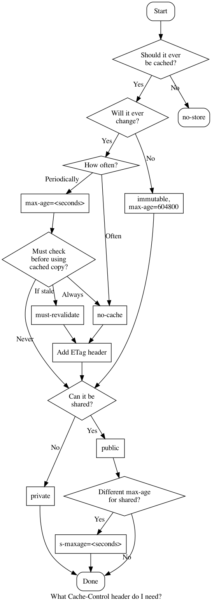

# Cache-Control flowchart

A flowchart that attempts to de-mystify the HTTP 
[Cache-Control](https://developer.mozilla.org/en-US/docs/Web/HTTP/Headers/Cache-Control)
header.

Pull requests and corrections very welcome!

